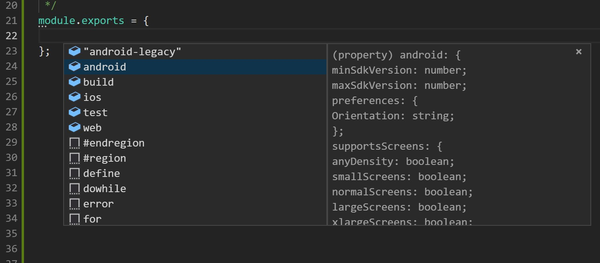
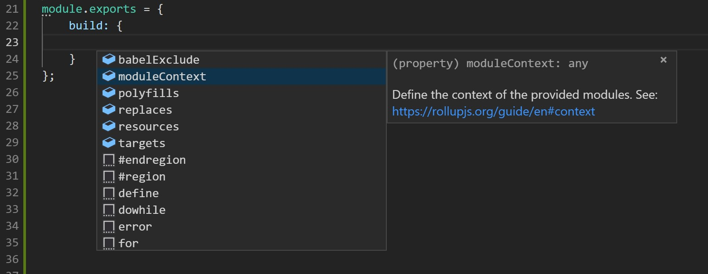

# @kano/kit-app-shell-cli

Run, build, test, deploy apps from your terminal

## Installation

```
yarn global add @kano/kit-app-shell-cli

kash --version
```

## Usage

Start by running `kash --help` to discover the available commands

```
Usage: kash <command> <args> [options]

Commands:
  run <platform> --help        Show help for the run command
  build <platform> --help      Show help for the build command
  test <platform> --help       Show help for the test command
  configure <platform> --help  Show help for the configure command
  open config                  Open the location of your configuration

Options:
  --help     Show help                                                    [commands: help] [boolean]
  --version  Show version number                                       [commands: version] [boolean]
```

## Config files

Configuration files can define options for commands and platforms. THere are two kinds of configuration files, the local rc, a personal file containing options specific to the current machine or user and the project's config, containing the options for a specific project.

You can see your own config file by running `kash open config`.

A project's config file must be located at the root of the porject and be named either:

 - 'kit-app-shell.conf.js'
 - '.kit-app-shell.conf.js'
 - 'kash.conf.js'
 - '.kash.conf.js'

The config file being a js module, you must export the configuration object.

### Personal config

This config is mainly used to store your personal preferences and credentials. You can modify the JSON file manually, but `kash` provides a way to update this file through the `configure` CLI command.

`kash configure` Will let you configure the CLI while `kash configure <platform>` will let you configure a specific platform.

### Project config

You can import the types from the core module to have access to autocompletion of your configuration file
```js
/**
 * @type {import('@kano/kit-app-shell-core/types').KashConfig}
 */
module.exports = {
  run: {/* ... */},
  build: {/* ... */},
};
```




### Env config

You can customize the temporaru directory for kash. This allows you to write to a directory you have the rights to, or avoid writing cached data to a volatile volume on systems like Docker.

Use the `KASH_TMP_DIR` env variable to set it.

## Development

### Speed

There is something frustrating about slow CLIs. To avoid that, this project tries to only load what is needed to ensure optimal speed.

The CLI routes the user through all the features of the core library and each platform implementation. Using a late require strategy, only the needed resources will be loaded for the path th user is taking.

`kash --version` should absolutely not load more than the tools to parse and display the version, the same goes for `kash --help`

In a similar fashion, `kash build android` should not load the test frameworks and `kash test android` should not load the build tools.

In this project you will see require statements that use paths instead of module name e.g.:

```js
const util = require('@kano/kit-app-shell-core/lib/util');
// instead of
const { util } = require('@kano/kit-app-shell-core');
```
While this is usually an anti pattern and can introduce issues when moving files around, this improves the speed of the commands drastically.

To provide some context, here are the times for printing the version of some CLIs (No benchmark, just ran on one's machine) (Keep in mind, node itself takes ~150ms to boot):

|Command|Time|
|---|---|
|`npm --version`|~700ms|
|`rollup --version`|~400ms|
|`yarn --version`|~300ms|
|`kash --version`|~200ms|
|`git --version`|~50ms|


## TODO:

 - Add a flag for the reporter
 - Add a JSON reporter
 - Add `kash configure` to configure the choosen reporter and other personal options