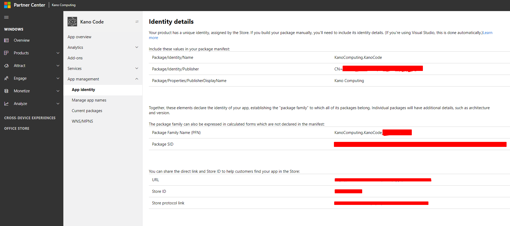

# KASH Windows Store

Builds an .appx to be published on the Windows Store

## Setup

To build applications for the Windows Store, you will need a developer certificate. Each certificate is tied to a publisher.
If you are building an app locally and don't intend to publish it as is, you can use any publisher. e.g. CN=Myself.
If you are preparing a Store Submission, see the Preparing a submission chapter.

Now run `kash configure windows-store`, choose Create a new certificate and input your choosen Publisher. This will create a save a certificate for that publisher and will be used when building the .appx package.

In your project's config files add the following:

```json
{
    "WINDOWS_STORE": {
        "PACKAGE_NAME": "<Package name>",
        "PACKAGE_DISPLAY_NAME": "<Display name>",
        "PUBLISHER": "<Publisher>",
        "PUBLISHER_DISPLAY_NAME": "<Publisher Display Name>"
    }
}
```
This information can be found in the App identity section of the Microsoft partner center. For a local test, you can choose these fields, but make sure your generated certificate uses the same publisher as the one defined here.

### Preparing a submission

Login the partner center at https://partner.microsoft.com/en-us/dashboard/windows/overview,
navigate to your app in Overview > [App] > App Managment > App identity



You will find here all the info to fill in the fields in your project's config files


## TODO
 - Generate icons: 300x300, 150x150, 71x71, banners etc